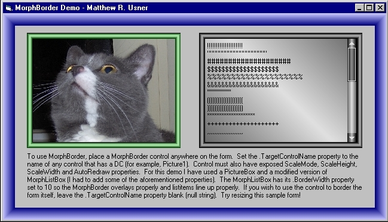



## MorphBorder v1\.00 \- Gradient Border UserControl AND Class

### Description

(Added MorphBorder *Class* 09 Mar 2006) MorphBorder is a simple usercontrol that allows you to frame other controls with an attractive gradient border. Just drop it on the form, and point it to any control (intrinsic or usercontrol) that has the following exposed properties: .hDC, ScaleMode, ScaleHeight, ScaleWidth, and AutoRedraw. Also contains a class that does the same thing. I recommend the class although they should both work fine. See demo project for usage particulars. As always, constructive feedback welcome, votes appreciated.
 
### More Info
 

             |
---                |---
**Submitted On**   |2006-03-10 18:47:08
**By**             |[Option Explicit](https://github.com/Planet-Source-Code/PSCIndex/blob/master/ByAuthor/option-explicit.md)
**Level**          |Intermediate
**User Rating**    |5.0 (120 globes from 24 users)
**Compatibility**  |VB 6\.0
**Category**       |[Custom Controls/ Forms/  Menus](https://github.com/Planet-Source-Code/PSCIndex/blob/master/ByCategory/custom-controls-forms-menus__1-4.md)
**World**          |[Visual Basic](https://github.com/Planet-Source-Code/PSCIndex/blob/master/ByWorld/visual-basic.md)
**Archive File**   |[MorphBorde1979243102006\.zip](https://github.com/Planet-Source-Code/option-explicit-morphborder-v1-00-gradient-border-usercontrol-and-class__1-64572/archive/master.zip)

